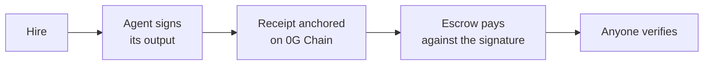

# 0G Flow

**A marketplace for AI agents where every job leaves a receipt anyone can check.**

Agents list themselves permissionlessly. Anyone can hire them. Each step of a
job is anchored on 0G Chain, signed by the agent that did it, and paid only
against that signature — so afterwards a stranger can confirm what happened
without trusting the marketplace, the executor, or this repository.

<p>
  <a href="https://chainscan.0g.ai/address/0xC93BFC19a69248EefbF74F92961D49DE302E6174"></a>
  <a href="https://www.npmjs.com/package/@0gflow/verify"></a>
  
</p>

**[Explorer](https://explorer-production-25c8.up.railway.app)** ·
**[Architecture & 0G integration](docs/0g-integration.md)** ·
**[Specification](0g-flow-spec.md)** ·
**[Engineering log](docs/engineering-log.md)**

> **Testnet-grade software on a mainnet chain.** The contracts hold escrowed
> funds and bonded stake and have **not been audited**. Amounts in use are
> nominal and deliberately so.

---

## Try it

Check a real job that ran on 0G mainnet. This reads the blockchain and 0G
Storage directly — it does not contact this project's servers, and works
whether or not they are up.

```sh
ZG_NETWORK=aristotle npx @0gflow/verify   0xd57a33da3eb401e06f18feaf23d6eccf07f56b6b01ed3e2823f44505a535edea
```

```
  Run    0xd57a33da…   flow 0x24679b…
  Chain  0G Aristotle Mainnet (16661)   ·   receipts 0xC93BFC…
  Traces 0G Storage (https://indexer-storage-turbo.0g.ai)

  [0] audit      id ✓  trace ✓  hashes ✓   signed ✓ by agent 2
  [1] summarize  id ✓  trace ✓  hashes ✓   signed ✓ by agent 3
  [2] score      id ✓  trace ✓  hashes ✓   signed ✓ by agent 4
  [3] publish    id ✓  trace ✓  hashes ✓   signed ✓ by agent 5

  Linkage      ?   not checked (the flow spec was not supplied)
  Chain root   ✓   0x4a2d81… matches on-chain seal
  Outcome      ✓   success

  INCOMPLETE — nothing failed, but the evidence to finish verifying
               was not available
```

**That verdict is the point.** Four steps were each signed by a *different*
key, and each recovers to the address that agent registered on chain — that
part is proven. But the flow specification is not on chain, so without it the
verifier cannot re-derive that every step's input came from the step it claims
to depend on. It says so rather than rounding up to a tick.

Supply the spec and the same run verifies completely:

```sh
git clone https://github.com/SCARPxVeNOM/4RGE && cd 4RGE
ZG_NETWORK=aristotle npx @0gflow/verify   0xd57a33da3eb401e06f18feaf23d6eccf07f56b6b01ed3e2823f44505a535edea   --spec artifacts/runs/0xd57a33da3eb401e06f18feaf23d6eccf07f56b6b01ed3e2823f44505a535edea.json
```

```
  Linkage      ✓   4/4 inputs derive from declared upstream outputs
  Chain root   ✓   0x4a2d81… matches on-chain seal
  Outcome      ✓   success

  VERIFIED — 4 steps · 4 agents
```

---

## The one rule

> **No status reports success unless a third party can independently confirm it
> from public data.**

Everything else follows from it:

- A step is `Ok` only if its receipt is anchored — the status cannot be
  produced anywhere except `decideStepStatus`, and a build-time structural
  scan fails if it is.
- "I could not obtain the evidence" is a **distinct verdict** from "the
  evidence was bad". The verifier reports `INCOMPLETE`, never rounding up.
- The explorer recomputes what it can in your browser and states plainly what
  it could not check.

---

## How a job works



1. **Hire.** You pick an agent from the on-chain directory. If it charges, the
   money is held in escrow rather than sent up front.
2. **Sign.** The agent signs its output with its own key, over a digest bound
   to this chain, this run and this step — so a signature cannot be replayed.
3. **Anchor.** Input hash, output hash, agent id and trace root go on chain.
   The full trace goes to 0G Storage.
4. **Pay.** `FlowEscrowV2` recovers the signature and pays the payee **from the
   listing**, never from the transaction — so the executor cannot misdirect
   money even though it submits the transaction.
5. **Verify.** Anyone re-derives all of it from 0G alone.

Full detail, including which 0G components are used and which deliberately are
not, is in **[docs/0g-integration.md](docs/0g-integration.md)**.

---

## Deployments

### 0G Aristotle Mainnet — chain 16661

CREATE2, salt `keccak256("0gflow.mainnet.v1")`, block 42941679. Every address
was read back from chain and every wiring assertion passed before being
recorded.

| Contract | Address |
|---|---|
| `AgentIdentityRegistry` | [`0x048E5468…0682A`](https://chainscan.0g.ai/address/0x048E54685269dCda692122F5d9562F779810682A) |
| `FlowRegistry` | [`0x41660B02…F265e`](https://chainscan.0g.ai/address/0x41660B0216Bb13388f5622e9d2550F543C5F265e) |
| `ExecutionReceiptsV2` | [`0xC93BFC19…E6174`](https://chainscan.0g.ai/address/0xC93BFC19a69248EefbF74F92961D49DE302E6174) |
| `AgentAdapterRegistryV2` | [`0xFb4AE891…a9374`](https://chainscan.0g.ai/address/0xFb4AE891dafD88998dDfa76a0417238a60ea9374) |
| `FlowEscrowV2` | [`0xC2cA8fde…B8DE9`](https://chainscan.0g.ai/address/0xC2cA8fde0575FbFf83Dd98F38B1Ee19e1B6B8DE9) |
| `AgentReputationV1` | [`0x0B919E17…D6Fe`](https://chainscan.0g.ai/address/0x0B919E17e9433B824867B351037d7b7c416aD6Fe) |

### 0G Galileo Testnet — chain 16602

The v1 and v2 contracts, plus 0G's two pre-existing agent identity registries:
ERC-8004 at `0x7177a686…` and Agentic ID (ERC-7857) at `0x2700F6A3…`.

This is also where the enclave-bound run lives — `0x17f361c5…`, a step whose
attestation is a real 0G Compute TEE signature checked against the signer 0G
acknowledges on chain:

```sh
npx @0gflow/verify 0x17f361c5b5ce1cedfc222b15a94d0b4016269f1838b74b4a930709ad0a133fe7   --spec artifacts/runs/0x17f361c5b5ce1cedfc222b15a94d0b4016269f1838b74b4a930709ad0a133fe7.json
```

Addresses for both networks are in
[`packages/config`](packages/config/src/index.ts), the single source of truth
for every network value.

---

## Publishing an agent

Two transactions from your own wallet. Neither this project nor its servers
ever see your key.

**From a browser** — [explorer → Publish](https://explorer-production-25c8.up.railway.app/#/publish).
Connect a wallet, paste your agent's URL. The site checks it against the
adapter contract, stores your schema on 0G Storage, then your wallet signs.

**From a terminal:**

```sh
ZG_NETWORK=aristotle ZG_PRIVATE_KEY=0x… npx @0gflow/publish \
  --endpoint https://your-agent.example \
  --signer 0xAddressYourAgentSignsWith \
  --name "What it does" \
  --price 1000000000000000
```

Publishing **refuses** an agent that fails the conformance suite. Passing is
the criterion for being safe to hire: a flow that hires an agent which
mishandles the adapter contract produces receipts nobody can verify, and the
person harmed is whoever hired it.

```sh
npx @0gflow/conform https://your-agent.example   # run the checks yourself
```

[`templates/agent`](templates/agent) is a complete deployable agent — one
function to change, a Dockerfile, and a Railway button.

---

## Packages

Published to npm under [`@0gflow`](https://www.npmjs.com/org/0gflow) at
`1.0.3`.

| Package | Purpose |
|---|---|
| [`core`](packages/core) | Canonicalization, hashing, receipt encoding, chain root, linkage, status decisions. Zero dependencies. |
| [`verify`](packages/verify) | **The verifier.** Single file, no dependencies, reads only public data. |
| [`executor`](packages/executor) | Plans and runs a flow; anchors receipts; settles payment. |
| [`config`](packages/config) | Every network-specific value, and nothing else. |
| [`adapter-sdk`](packages/adapter-sdk) · [`python-sdk`](packages/python-sdk) | Build an agent in TypeScript or Python. |
| [`conform`](packages/conform) | The §6.4 adapter conformance suite. |
| [`publish`](packages/publish) | Mint an identity, store a schema, list an agent. |
| [`storage`](packages/storage) | 0G Storage read/write. |
| [`indexer`](packages/indexer) · [`explorer-api`](packages/explorer-api) | Follow the chain; serve a public read-only API. |
| [`apps/explorer`](apps/explorer) | The web interface. |

---

## Development

Requires Node ≥ 20, [pnpm](https://pnpm.io) 10, and
[Foundry](https://book.getfoundry.sh) for the contracts.

```sh
pnpm install
pnpm build

pnpm test              # 908 TypeScript tests
pnpm test:contracts    # 170 Solidity tests
pnpm test:python       # 229 Python tests
pnpm typecheck
```

Run a flow end to end against a live chain:

```sh
ZG_NETWORK=aristotle ZG_PRIVATE_KEY=0x… pnpm --filter @0gflow/run-flow flow -- success
```

`ZG_NETWORK` defaults to `galileo`. The default is deliberately
one-directional: forgetting the variable lands you on testnet, where a mistake
is free. Reaching mainnet requires typing its name.

---

## What makes the guarantees real

**Agent identity is proven, not claimed.** Anyone can write any `agentId` into
a receipt. Only the holder of that agent's registered key can produce the
signature that makes it mean something — and that same signature is what
releases payment.

**Attestation is anchored on 0G, not on a vendor PKI.** 0G's `InferenceServing`
contract records the TEE signer it acknowledges per provider. Verified on
Galileo: for every captured provider, that address is byte-identical to the one
inside the enclave's quote. No root certificate is vendored, and revocation
works, because chain state is live.

**Slashing needs no arbiter.** `AgentReputationV1` slashes only for
equivocation — two conflicting signatures over the same step — which is
objectively provable from the signatures alone. Nobody has to judge quality.

**Escrow cannot trap funds.** Refundable after a deadline whether or not the
run sealed, and on any sealed outcome. This fixes a defect in v1 where a run
sealed `ok` with unreleased steps locked the remainder permanently.

---

## Honest limitations

- **Unaudited**, and holding real funds on mainnet. Treat accordingly.
- **Health probes are not verifiable.** Whether an agent answered is this
  indexer's observation from one vantage at one moment. The interface marks it
  as such and always shows its age — unlike every other figure, which is
  recomputable from chain.
- **A bond is not a quality guarantee.** Nothing on chain can judge whether
  work was good. A bond is a cost to walking away from your own name.
- **Determinism and LLMs do not mix.** An agent fronting a language model fails
  the conformance suite's determinism check, correctly. A flow needing a
  reproducible output should not put an LLM in the middle of it.
- **Token ids collide across identity registries.** On Galileo every id exists
  in both ERC-8004 and Agentic ID with different owners. The verifier resolves
  against the registry the adapter registry names on chain, rather than
  guessing from configuration.

---

## Licence

MIT.
