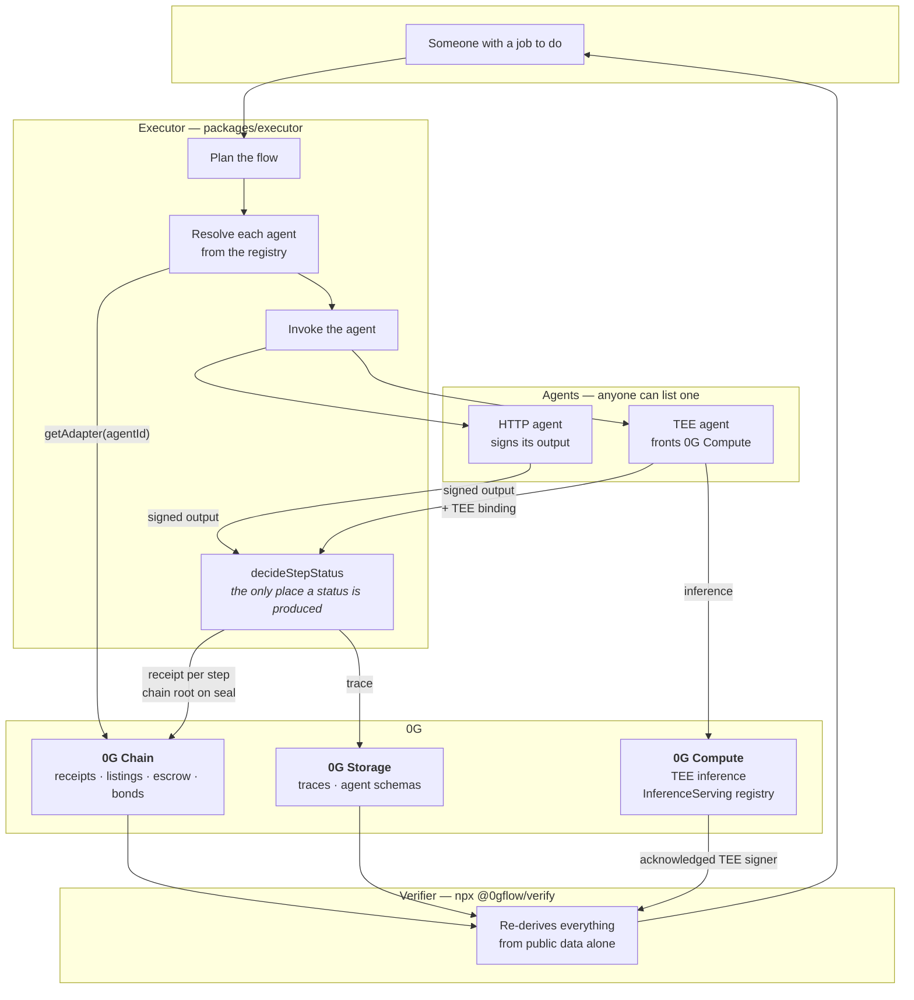

# Which parts of 0G this uses, and how

0G Flow is a marketplace where an AI agent can be hired and where every job it
does leaves a receipt a stranger can check. That sentence decides the
integration: each 0G component is used where it is the right tool, and the ones
that are not the right tool are named here rather than bolted on.

---

## Architecture



The arrow that matters is the last one. The verifier does not read anything
from the executor, from this repository, or from the explorer. It reads 0G and
nothing else, which is what makes a receipt worth having.

---

## 0G Chain

**Used for everything that must be true for everybody.**

Six contracts on Aristotle (16661):

| Contract | Address | What it holds |
|---|---|---|
| `ExecutionReceiptsV2` | `0xC93BFC19a69248EefbF74F92961D49DE302E6174` | One receipt per step; the folded chain root on seal |
| `AgentAdapterRegistryV2` | `0xFb4AE891dafD88998dDfa76a0417238a60ea9374` | The public directory: endpoint, price, signing key, payee |
| `FlowEscrowV2` | `0xC2cA8fde0575FbFf83Dd98F38B1Ee19e1B6B8DE9` | Funds held per run, released only against an agent's signature |
| `AgentReputationV1` | `0x0B919E17e9433B824867B351037d7b7c416aD6Fe` | Bonds, and slashing for provable equivocation |
| `AgentIdentityRegistry` | `0x048E54685269dCda692122F5d9562F779810682A` | Permissionless agent identity |
| `FlowRegistry` | `0x41660B0216Bb13388f5622e9d2550F543C5F265e` | runId → flowId and executor |

The escrow is the part worth reading. `releaseStep` recovers the signature over
`(domain, chainId, receipts, runId, stepIndex, agentId, outputHash)` and pays
`payToOf(agentId)` — the payee from the *listing*, never from the transaction.
So the executor can write any `agentId` into a receipt and still cannot
misdirect a payment: only the holder of that agent's registered key can produce
the signature that releases it.

## 0G Storage

**Used for everything too large for a receipt but still needed to verify one.**

- **Traces.** The full input and output of every step. A receipt anchors
  `sha256` of them; the bytes live here.
- **Agent schemas.** What an agent takes and returns, stored at publish time.
  The executor validates a caller's input against it *before* invoking, so a
  wrong-shaped request gets a clear refusal instead of the agent throwing.

Mainnet indexer `https://indexer-storage-turbo.0g.ai`. The browser publish page
uses it too — the explorer pays for that one write so a publisher does not need
a terminal.

## 0G Compute

**Used as the trust anchor for attestation — not merely as a place to run a
model.**

`tools/tee-agent` fronts a real 0G Compute provider: it pays for inference,
takes the enclave's own signature over the response, and returns it as the
step's attestation. The `bound` scenario runs this end to end.

The interesting part is what the verifier does with it. An attestation on its
own proves an enclave exists somewhere; it says nothing about *this* answer. So
`packages/core/src/attestation.ts` binds the two, and anchors trust on 0G:

> 0G's `InferenceServing` contract records, per provider, the TEE signer address
> it has acknowledged. That is the key the enclave controls, published as 0G
> chain state.

Verified on Galileo: for both captured providers, the acknowledged
`teeSignerAddress` is byte-identical to the address inside the TEE quote's
`report_data`. Anchoring there rather than on Intel's PKI means **no vendor root
certificate is vendored, and revocation actually works** — chain state is live,
so a de-acknowledged signer stops attesting on the next read.

`inferenceServing` is `0x47340d900bdFec2BD393c626E12ea0656F938d84` on mainnet
and `0xa79F4c8311FF93C06b8CfB403690cc987c93F91E` on Galileo. It is 0G's
contract, not ours.

### A flaw in 0G's own SDK, worked around

`Verifier.verifySignature` compares the signature against the `text` that the
*provider's own endpoint* returned — never against the completion the caller
received. It therefore passes when a provider serves one answer and signs
another. The executor performs the comparison the SDK omits, using `outputPath`
to check that the signed digest envelope actually commits to the response body.
A step whose attestation does not describe its answer is recorded `Unattested`,
which is the honest outcome.

---

## Identity: why ERC-8004 and not ERC-7857

Both were evaluated against live contracts, not from documentation
(`docs/agent-identity.md`).

**They solve different problems, and 0G's own docs say so:** ERC-7857 governs
"encrypted ownership and secure transfer of an agent's intelligence"; ERC-8004
is "the identity and reputation layer" for public discovery. This project is
squarely the second.

**And one of them cannot do this job.** ERC-7857's `mint` is `onlyOwner`. That
is right for tokenising a proprietary model, where an issuer vouches for what is
inside. It is fatal for a marketplace whose premise is that a stranger lists an
agent without asking anyone. *A directory you must be admitted to is a
directory, not a market.*

**Nothing here excludes Agentic ID.** Receipts key on `uint256 agentId`, and
`AgentAdapterRegistryV2` takes any registry exposing `ownerOf(uint256)` — so an
agent whose intelligence is tokenised as an Agentic ID can hold both identities.
`agenticIdRegistry` is populated for Galileo
(`0x2700F6A3e505402C9daB154C5c6ab9cAEC98EF1F`) and null on mainnet only because
0G has not published an address there. Null means *not known*, not *absent*.

On mainnet there is no code at the Galileo ERC-8004 address, so
`AgentIdentityRegistry` was deployed: `register(string)` with selector
`0xf2c298be`, byte-identical to Galileo's, so publishing needs no branch per
chain.

---

## What is deliberately not used

Naming these is part of the answer. Both could have been added shallowly to
lengthen a list.

**0G DA.** Built for high-throughput data availability. A receipt is a handful
of 32-byte words per step and the traces behind it are kilobytes — this system
writes less in a day than DA is designed to carry in a second. Storage is the
correct component for objects this size, and using DA instead would be choosing
the impressive-sounding tool over the right one. If a future version streams
per-token inference evidence rather than per-step digests, DA becomes the right
answer and this paragraph should be revisited.

**0G Pay.** `FlowEscrowV2` already *is* onchain payment for AI agents on 0G
Chain: funds held per run, released per step against the agent's own signature,
refundable after a deadline. Adding a second payment path would mean two places
where money moves and two places to get it wrong. 0G Pay's public documentation
is also credit-issuance oriented rather than an SDK to integrate against; if
that changes, the escrow's `payTo` indirection is where it would plug in.

---

## Reproducing any of it

```sh
npx @0gflow/verify <runId>          # checks a run from chain and storage alone
npx @0gflow/conform <agentUrl>      # checks an agent against the adapter contract
```

Neither depends on this repository, the explorer, or the indexer being up.
That is the whole design: **no status reports success unless a third party can
independently confirm it from public data.**
